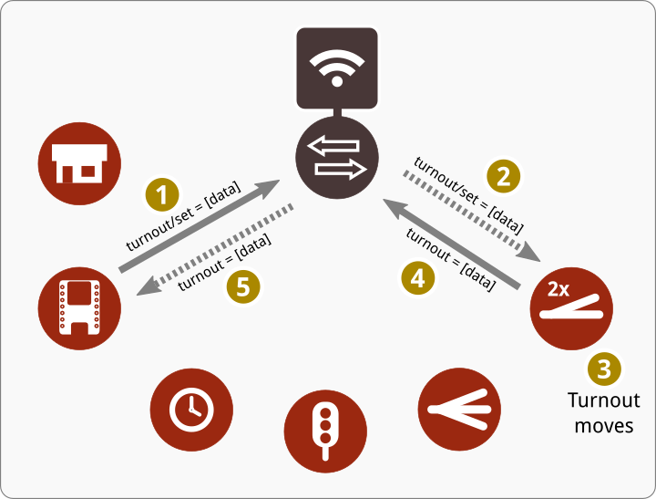

[Home](README.md) > MMRC Overview

# MMRC Overview
This document is written in swedish only.

### Koncept
Tanken med MMRC är att skapa ett flexibelt och decentraliserat sätt att styra modelljärnvägar. Grunden i konceptet är att man har en central meddelandeserver (s.k. MQTT-broker) och olika typer av klienter som var och en sköter sin funktion på modelljärnvägen. Klienterna kan sedan kommunicera via meddelandeservern för att både styra och bli styrda av varandra.

Genom att använda trådlöst nätverk och små, billiga kretskortsdatorer blir systemet väldigt flexibelt. Det passar speciellt bra på modelljärnvägsmoduler som kan vara placerade på olika platser i en bana, men ändå ska kunna styras och övervakas centralt.

### MMRC-kommunikationen
Genom att använda trådlös kommunikation och en central meddelandeserver, får man stor flexibilitet i styrningen av sin modelljärnväg. I princip kan vilken klient som helst "prata" med vilken annan klient som helst.

Eftersom det inte finns någon central styrning i systemet (meddelandeservern är "dum" och förmedlar bara meddelanden) kan man ändra, bygga ut och lägga till i systemet som man vill. Det behövs inga nya kabeldragningar utan möjligen lite omkonfigurering när man ska ändra.

**Skicka kommando & status**

En kommunikation mellan två olika klienter kan gå till på följande vis. Den ena klienten har en tryckknapp och lysdioder för att indikera växelns läge, medan den andra klienter enbart styr en växel.

Knappklient har via en inställning bett meddelandeservern om att få alla meddelanden som växelklienten skickar om växelns läge. Växelklienten har i sin tur bett meddelandeservern om att få knappklientens alla meddelanden som säger att knappen har tryckts ner.

 1. Knappen trycks ner och klienten skickar ett kommando till meddelandeservern
 2. Växelklienten för kommando från meddelandeservern.
 3. Växeln utför kommandot (lägger om växeln).
 4. När växeln lagts om, skickar växelklienten status om växelns läge till meddelandeservern.
 5. Meddelandeservern skickar status vidare till knappklienten, som utefter vad som står i statusmeddelandet kan tända rätt lysdiod för att markera växelns läge..

### Meddelandeserver
En viktig del i MMRC är den centrala meddelandeservern. Till den bör man använda en lite mer kapabel dator och ett förslag är att använda Raspberry Pi med t.ex. Mosquitto installerat.

Eftersom det kan vara lämpligt att styra modelljärnvägen separat från sitt vanliga trådlösa nätverk, kan man använda Raspberry Pi även till att skapa ett separat nätverk för enbart MMRC. På det sättet får man både en kompakt, smidig och portabel lösning som även passar för moduler.

### Klienter
En klient för MMRC kan ha vilka funktioner som helst. Det är upp till den som bygger och programmerar klienten att bestämma vad den ska kunna göra. Det enda viktiga är att klienten kommunicerar på ett standardiserat sätt, enligt [MMRC Convention](MMRC Convention.md).

Det finns inte heller något som bestämmer hur många uppgifter en klient utför. På en liten modul kanske en klient sköter både växel och signaler, medan en större station kanske har olika klienter för växlar, signaler och ställverket. Man kan också tänka sig en signalmodul som bara har in- och utfartssignal styrd av en egen klient.

### Varför inte CLEES?
Idéerna till MMRC har jag haft länge, men det var först när [CLEES](https://github.com/TomasLan/CLEES/) dök upp som jag fick inspiration nog att ta tag i mina egna idéer på allvar. Skillnaderna mellan MMRC och CLEES är små; i grunden är det samma tankar.

Men det som gjorde att jag inte följde CLEES var att jag vill ha en mer generellt uppbyggnad av meddelandena. Genom att utgå från MMRC Convention tror jag att MMRC-systemet blir mer flexibelt och mindre bundet av att varje meddelandetyp ska definieras. Det borde ge användaren större frihet och göra systemet mer användbart.