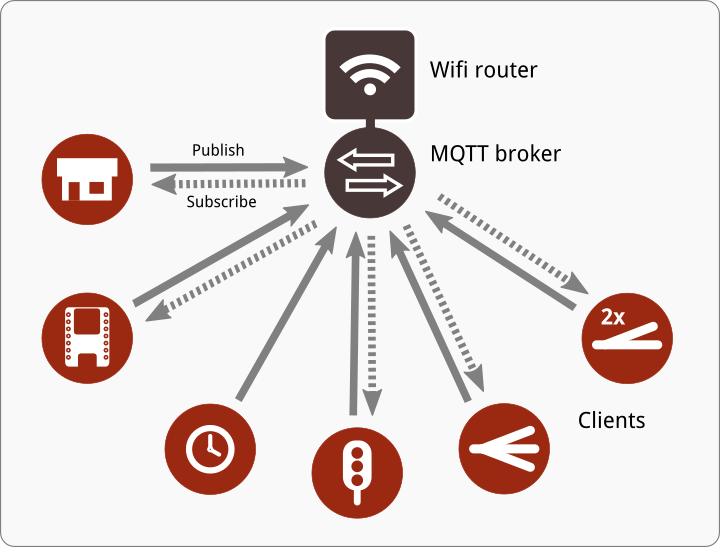

[Home](README.md) > MMRC Overview

# MMRC Overview
This document is written in swedish only.

### Koncept
Tanken med MMRC är att skapa ett flexibelt och decentraliserat sätt att styra modelljärnvägar. Grunden i konceptet är att man har en central meddelandeserver (s.k. MQTT-broker) och olika typer av klienter som sköter olika funktioner på modelljärnvägen. Klienterna kan sedan kommunicera med varandra via meddelandeservern för att både styra och bli styrda av andra klienter.

Genom att använda trådlöst nätverk och små, billiga kretskortsdatorer blir systemet väldigt flexibelt. Det passar speciellt bra på modelljärnvägsmoduler som kan vara placerade på olika platser i en bana, men ändå ska kunna styras och övervakas centralt.

### MMRC-kommunikationen
När man ska programmera sina klienters kommunikation, behöver man förstå principerna för hur MQTT och MMRC Convention är tänkt att fungera:

**Bestäm vem som bestämmer**

Först måste man bestämma sig för vilken väg kommunikationen ska gå, t.ex. om en växel ska lyssna (subscribe) på knappens ämne (topic) eller om knappen ska publicera (publish) till växelns ämne (topic)?
Det spelar ingen roll, men måste bestämmas så du vet hur du ska programmera de olika klienterna. I exemplet med knapp och växel finns det alltså följande två ämnen att välja mellan:

`/mmrc/device01/node01/turnout/set`
om knappen ska styra växeln

`/mmrc/device04/node2/button/`
om växeln ska lyssna på knappens läge

MMRC (och Homie) Convention säger också att man anger status för en pryl direkt i ämnet (t.ex. `/mmrc/device01/node01/turnout`) men skickar kommandon till samma pryls "/set"-attribut (t.ex. `/mmrc/device01/node01/turnout/set`). Därav lite olika utseende på ämnen i exemplet ovan.

**Skicka kommando & status**

Om vi nu väljer att kommunikationen ska ske via växelns ämne, så kommer följande att behöva hända, se punkterna i bilden.

 1. Knappen skickar data (payload) till växelns `.../set`-ämne på MQTT-brokern.
 2. Växeln, som sen tidigare prenumererar på sitt eget `...turnout/set`-ämne får nu meddelande tillsänt.
 3. Växeln utför kommandot (lägga om växeln och kanske styra en signal).
 4. När växeln lagts om, skickar den samma data (payload) tillbaka via MQTT-brokern till sitt `...turnout`-ämne som en status på att allting gått bra.
 5. Om knappen lyssnar på växelns status (...turnout`) kan den nu se att växeln blivit omlagd.

Punkt 4 ska man alltid göra. Det finns däremot inget krav på att göra punkt 5, men det är lämpligt så man kan se att kommandot har tagits emot och utförts.

### Meddelandeserver
En viktig del i MMRC är den centrala meddelandeservern. Till den bör man använda en lite mer kapabel dator och ett förslag är att använda Raspberry Pi med t.ex. [Mosquitto](http://mosquitto.org/) installerat.

### Klienter
Det finns inga specifika typer av klienter i detta system. Det är upp till den som programmerar klienten att bestämma vad den ska kunna göra. Denna test-klient kan exempelvis bara tända och släcka en lysdiod, men mer troliga funktioner är att styra växlar, signaler och känna av tryckknappar.

Det finns inget som bestämmer hur många uppgifter en klient utför. På en liten modul kanske en klient sköter både växel och signaler, medan en större station kanske har olika klienter för växlar, signaler och ställverket. Man kan också tänka sig en signalmodul som bara har in- och utfartssignal styrd av en egen klient.

### CLEES-kompatibel
Idéerna till MMRC har jag haft länge, men det var först när [CLEES](https://github.com/TomasLan/CLEES/) dök upp som jag fick inspiration nog att ta tag i mina egna idéer på allvar. Skillnaderna mellan MMRC och CLEES är små; i grunden är det samma tankar. Största skillnaden är att CLEES koncentrerar sig på klienter som klarar av ganska många saker, medan MMRC mer är inne på en klient = en uppgift.

Tack vare likheterna finns möjligheten att MMRC kan samexistera med CLEES och styra/styras av CLEES-klienter. I vissa klientprogram kan det finns en inställning som gör att klienten blir CLEES-kompatibel.
