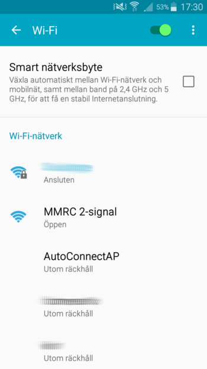
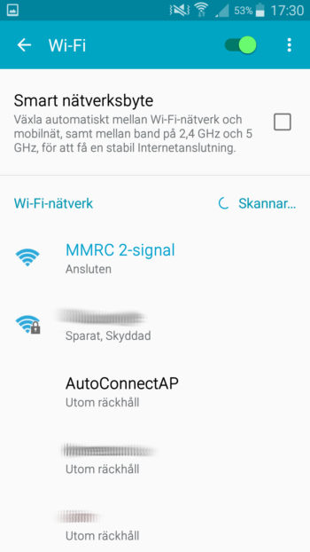
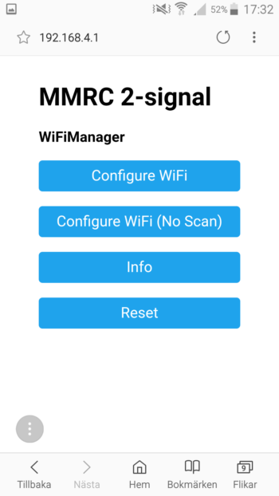
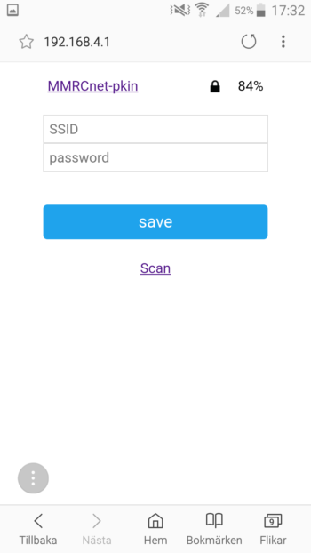

[Home](README.md) > MMRC Settings

# MMRC Inställningar
De flesta MMRC-klienter har flera olika inställningar som kan behöva justeras beroende på användningsområde. Tyvärr ligger de flesta inställningar i själva programkoden och för att ändra dessa måste man ladda in en ny version med de nya inställningarna i klienten. Detta gör man i Arduinons utvecklingsmiljö och kan vara lite svårt för den som inte är van.

De flesta inställningar ligger i en speciell konfigurationsfil som heter "MMRCsettings" och den läses in när man kompilerar koden för att ladda upp den till klienten. Här nedan beskriv de mer generella inställningar som vanligen finns i en klient. För mer specifik beskrivning måste du titta i varje klients egen dokumentation.

## Funktionsinställningar
De flesta klienter har inställningar som styr hur den ska fungera. Det kan vara vilket urval av kommandon den ska reagera på, en försignals blinkhastighet eller hur snabbt ett servo ska lägga om en växel. Det finns inga definierade funktionsinställningar, utan dessa dokumenteras för respektive klient.

En vanlig typ av funktionsinställning är de olika ämnen som en nod kan behöva lyssna på (prenumerera/subscribe) eller skicka till (publicera/publish). Dessa används när man behöver kommunicera med andra klienter och hur de sak se ut beror förstås på hur denna klient är inställd. _Exempelvis kan en signalnod lyssna på en växelns ämne "mmrc/pkin-modul02/turnout1/move" för att känna av när växeln läggs om och då ändra signalbilden._

## MMRC-inställningar
När det gäller kommunikationen används MMRC Convention. Där finns ett antal olika inställningar som behöver göras i en klient behöver för att den ska kunna fungera väl i sitt nätverk. Som standard finns ett antal ämnen (topics) som en klient måste hantera. Dessa ämnen är uppbyggda på följande sätt:

`mmrc/deviceID/nodeID/property`

På varje nivå finns sedan ett antal fakta som behöver ställas in. Det olika nivåerna och deras fakta är följande:

### Device
Den andra nivån i MMRC-strukturen är informationen om själva klienten. 

- **deviceID** är den unika identitet klienten får. Det kan exempelvis vara en MAC-adress, en sifferserie eller en kombination av din signatur och modulens/områdets namn. _Exempelvis "pkin-sj06" eller "ssva-hfs"._
- **$name** är det mer läsvänliga namnet på klienten. _Exempelvis "Suckunge modul 6" eller "Holmfors station"_
- **$state** talar om i vilken status klienten befinner sig i. Detta är en speciell inställning som även kan visa när en klient plötslig slutat fungera. Här finns det definierade status i MMRC Convention som ska användas.
- **$nodes** är en kommaseparerad lista över vilka olika delar (noder) det finns i klienten. Olika delar kan göra olika saker, kanske både hantera en knapp, en lysdiod och en växel. Det här är ingen inställning du behöver göra, utan informationen hämtas från de olika nodernas inställningar. _Exempelvis "turnout1,turnout2" eller "button,led,turnout"._

### Node
På den tredje nivån hamnar all information om klientens olika noder, eller kanske man kan kalla dem funktioner. Följande inställningar behöver göras per node:

- **nodeID** är den unika identiteten för denna node. Det kan exempelvis vara "turnout", "signal" eller "button" och om det finns flera noder av samma sort, kanske "signal1" och "signal2".
- **$name** är det mer läsvänliga namnet på noden. _Exempelvis "Växel 01" eller "Infartssignal vänster"_
- **$type** beskriver vilken typ av nod det är - vad den gör/hanterar. Här är det ganska fritt vad som anges, men lämpligt kan vara att ange något i stil med "huvudsignal" eller "2-vägs-växel".
- **$properties** är en kommaseparerad lista över vilka olika egenskaper denna node har. Informationen i denna lista kommer från nodens respektive egenskaper.

### Property
På sista nivån talar man om vilka egenskaper varje nod har.

- **property** är en (av kanske flera) egenskaper som denna denna node har. För en signal skulle det kunna vara "main" och "slave" för huvudsignal och försignal eller för enklare saker kanske bara "move", "light" eller "push".
- **$name** är det mer läsvänliga namnet på egenskapen. _Exempelvis "Växelomläggning" eller "Signalbild"_
- **$datatype** beskriver vilken typ av data som kan läsas från och/eller skickas till egenskapen. Vilka egenskaper som kan förekomma finns att läsa i MMRC Convention. _Exempelvis "string" eller "boolean"._

## Nätverksinställningar
När en MMRC-klient startar, försöker den alltid koppla upp sig mot samma nätverk som förra gången. Skulle den då inte hitta nätverket, startar den istället en egen webbserver och visar en sida där nya nätverksinställningar kan göras.

På det viset kan en klient enkelt användas på olika nätverk, t.ex på en modulträff eller om du vill göra tester. Webbsidan visas ju även den allra första gången en ny klient tas i bruk, så du kan göra inställningarna en första gång.

Det finns möjlighet att låta webbsidan visa alla klientens inställningar, vilket skulle göra att ingenting behöver ändras i programkoden och klienten blir mer användarvänlig. _Tyvärr är dessa funktioner ännu inte införda._

### Starta klienten
När du startar din klient första gången, eller när du bytt nätverk, måste du göra nya inställningar av klienten. Det gör man lämpligen via en mobiltelefon eller surfplatta med wifi.

Starta mobilen och gå till dess nätverksinställningar. Där kan troligen se eller scanna efter nya nätverk. Här bör du kunna se ett öppet nätverk som heter något med "MMRC xxxxx", när klienten har startat. I exemplet nedan heter nätverket "MMRC 2-signal":

### Anslut till nätverket
Anslut till detta nätverk. Eventuellt får du ange ett lösenord, som i en oförändrad programkod är "1234".

### Surfa till webbsidan
Du kan nu starta mobiltelefonens webbläsare och surfa till godtycklig webbplats. Genom att du är ansluten till ett väldigt lokalt nätverk, kommer du förhoppningsvis bara att komma till klientens egen inställningssida. På webbsidan har du sen fyra olika val att göra.

### Knappen "Configure Wifi"
Den första knappen är mest användbar. Där får du möjlighet att ange nya nätverksinställningar.

Överst på webbsidan visas alla (synliga) nätverk som klienten kan hitta via wifi. Till höger visas dess signalstyrka, vilket kan hjälpa dig avgöra avståndet till din klient. Det är nätverkets SSID som visas och om du klickar på en rad kommer rutan SSID att fyllas i automatiskt. Du får sedan själv ange lösenordet.

När du är klar och klickar på "save" kommer klienten att starta om och försöka koppla upp sig med hjälpa av nya inställningarna. Förhoppningsvis går allt bra och du har lagt ännu en klient till ditt MMRC-nätverk.

Skulle inte nätverket synas, kan du antingen prova att scanna på nytt med "Scan"-länken alternativt har du valt att dölja nätverkets SSID och måste då skriva in det för hand.

### Knappen "Configure Wifi (No Scan)"
Här får du upp samma möjlighet som med Configure Wifi-knappen, men det finns inga föreslagna/scannade nätverk att välja bland.

### Knappen "Info"
Med Info-knappen kan du fått upp lite information om klientens hårdvara, så som exempelvis minnestorlek och MAC-adress.

### Knappen "Reset"
Detta alternativ startar om klienten.
